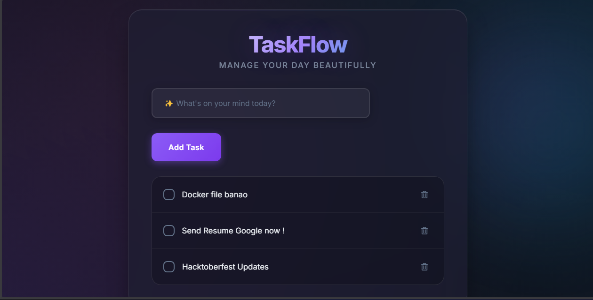

# ✅ TaskFlow — Modern Todo App

> A beautiful, modern task management application built with Django featuring a stunning dark-mode UI with glassmorphism effects.

TODO: Replace with new screenshot of dark mode UI -->


---

## 📋 Table of Contents

- [Features](#-features)
- [Tech Stack](#-tech-stack)
- [Getting Started](#-getting-started)
- [Docker Deployment](#-docker-deployment)
- [Usage](#-usage)
- [License](#-license)

---

## ✨ Features

- 🌙 **Dark Mode UI** — Premium glassmorphism design with animated backgrounds
- ⚡ **AJAX Updates** — Toggle tasks without page refresh
- 📱 **Responsive** — Works on desktop & mobile
- 🎨 **Micro-animations** — Smooth transitions and hover effects
- 🔒 **CSRF Protected** — Secure form submissions

---

## 🛠 Tech Stack

| Technology | Purpose |
|------------|---------|
| **Django 6.0** | Backend framework |
| **SQLite** | Database |
| **Bootstrap 4** | Base styling |
| **Custom CSS** | Glassmorphism & animations |
| **Docker** | Containerization |
| **Kubernetes** | Orchestration (optional) |

---

## 🚀 Getting Started

### Prerequisites

- Python 3.10+
- pip (Python package manager)

### Installation

1. **Clone the repository**
   ```bash
   git clone https://github.com/shreys7/django-todo.git
   cd django-todo
   ```

2. **Install dependencies**
   ```bash
   pip install django
   ```

3. **Run database migrations**
   ```bash
   python manage.py makemigrations
   python manage.py migrate
   ```

4. **Create admin user** *(optional)*
   ```bash
   python manage.py createsuperuser
   ```

5. **Start the development server**
   ```bash
   python manage.py runserver
   ```

6. **Open in browser**
   ```
   http://127.0.0.1:8000/todos
   ```

---

## 🐳 Docker Deployment

### Using Docker Compose

```bash
docker-compose up --build
```

### Using Docker directly

```bash
docker build -t taskflow .
docker run -p 8000:8000 taskflow
```

---

## 📖 Usage

| Action | How |
|--------|-----|
| **Add Task** | Type in the input field and click "Add Task" |
| **Complete Task** | Click the checkbox (no page refresh!) |
| **Delete Task** | Click the trash icon |

---

## 📄 License

This project is licensed under the [MIT License](LICENSE).

---

<p align="center">
  Made with ❤️ using Django
</p>
